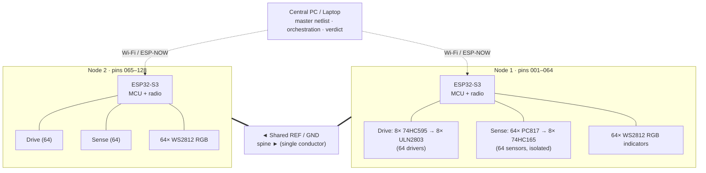
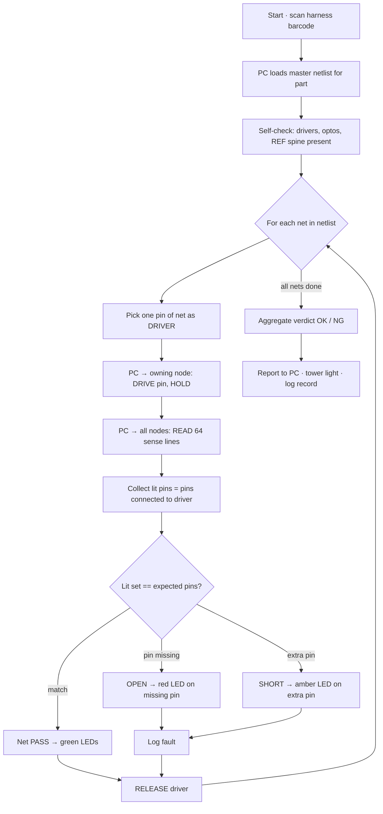
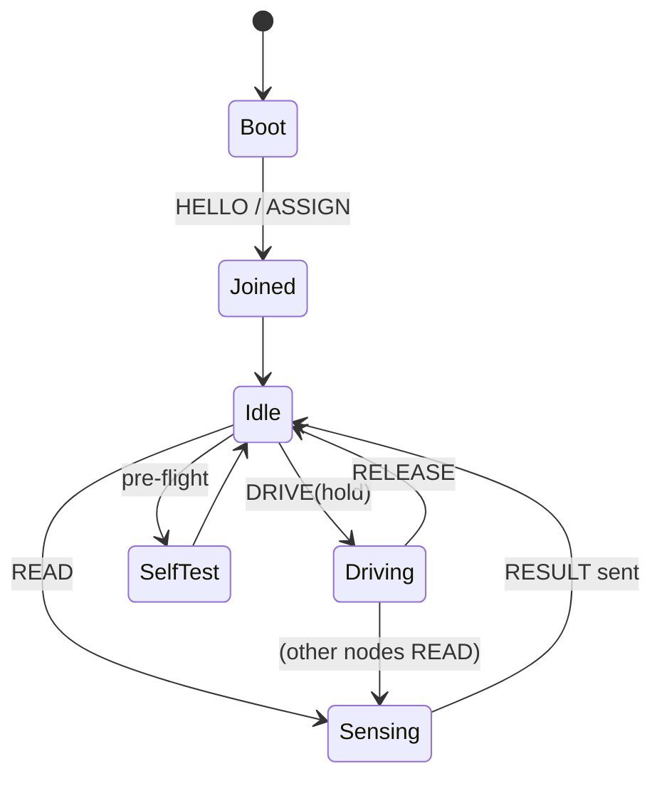

# Wireless Modular ECT — Engineering README

**Project:** Wireless, modular Electrical Check Tester (ECT / OMI-type) for automotive wire-harness continuity verification
**Author:** Humayun Khan · Deputy Manager R&D
**Stage:** Concept → 2-board proof of concept (POC)
**Scope (this document):** Continuity (go / no-go) testing only
**Central control:** Laptop / MacBook over telnet-serial (POC)

---

## Table of Contents
1. [Overview](#1-overview)
2. [System Architecture](#2-system-architecture)
3. [Operating Principle](#3-operating-principle)
4. [Per-Channel Circuit](#4-per-channel-circuit)
5. [Component Selection (POC)](#5-component-selection-poc)
6. [LED Indication](#6-led-indication)
7. [Wireless & Control](#7-wireless--control)
8. [Firmware Logic & Flowcharts](#8-firmware-logic--flowcharts)
9. [Test Workflow](#9-test-workflow)
10. [POC vs Industrial-Grade](#10-poc-vs-industrial-grade)
11. [Industrial-Grade Design](#11-industrial-grade-design)
12. [Bill of Materials (2-board POC)](#12-bill-of-materials-2-board-poc)
13. [Protection & Safety](#13-protection--safety)
14. [Sourcing in Pakistan](#14-sourcing-in-pakistan)
15. [Roadmap](#15-roadmap)
16. [Repository Structure](#16-repository-structure)

---

## 1. Overview

The tester is built from **modular 64-point nodes** instead of one large fixed machine.
Each node has its own MCU (ESP32-S3) and talks **wirelessly** to a central PC. Capacity
scales by adding nodes (64 → 128 → 192 …). Every pin gets a global address
`node_id : channel`. The harness plugs into the nodes; the PC holds the master netlist
and orchestrates the test.

**Key physical rule:** continuity is a *relative* measurement — the test current needs a
real return path. Radio carries commands and results, **not** the measurement. All nodes
therefore share **one common ground/reference conductor (the "REF spine")**. Everything
else is wireless.

---

## 2. System Architecture



**Three planes per node**

| Plane | Function | Isolation |
|---|---|---|
| Logic island | ESP32-S3, radio, LED driver | Isolated from field |
| Field drive | shift registers + drivers pull a pin toward REF | Field-referenced |
| Field sense | opto-couplers convert pin state to logic | Barrier = the opto |

The ESP32 sits on the isolated logic island; the only things crossing into the 24 V field
are the opto-coupled sense outputs and the isolated data lines to the drive registers.

---

## 3. Operating Principle

Continuity is checked **digitally** (connected / not connected), not by resistance.

**Drive-one, read-all method**

1. The PC picks **one pin of a net** as the *driver*.
2. That pin's node pulls the pin toward the **REF spine** (through its driver) and **holds** it.
3. Every node then reads all 64 of its sense lines at once.
4. Each pin electrically connected to the driven pin (through a harness wire and the REF
   return) shows up as **"lit."**
5. The set of lit pins = every pin joined to the driver.

**Interpreting the result**

| Lit set vs. master net | Meaning | Indication |
|---|---|---|
| Exactly matches expected pins | Net good | Green |
| A pin is missing | Open wire / bad crimp | Red on the missing pin |
| An unexpected pin is lit | Short / wrong insertion | Amber on the extra pin |

Because the driver is **held steady** while sensing, wireless latency/jitter does not
affect the result. One drive step clears an entire net, so the scan is fast and linear in
the number of nets.

- **Same-node net** (all pins on one card) → tested locally, no spine needed.
- **Cross-node net** → orchestrated by the PC; current returns through the REF spine.

---

## 4. Per-Channel Circuit

Each channel is both a **driver** (can pull its pin toward REF) and a **sensor** (reports
whether its pin is being pulled). One channel:

```
        +24V (field sense rail)
          │
         [R1] 2.2k                         ┌──────── isolation barrier ────────┐
          │                                │                                   │
          ├───────────────┐                │                                   │
          │            ╭──┴──╮  PC817       │                                   │
        (PC817 LED)    │ LED │──────────────┼── phototransistor ── to 74HC165 ─┼─► ESP32
          │            ╰──┬──╯              │        (logic 3.3V side)          │
          │               │                └───────────────────────────────────┘
     TEST PIN ────────────┤
       (to harness)       │
          │              [R2] 470  (drive current limit)
          │               │
          │        ULN2803 output (open-collector, sinks to REF)
          │               │
          └───────────────┴──────────── REF / GND spine
                                          ▲
                       74HC595 bit ──► ULN2803 input (selects this pin as driver)
```

**How one channel behaves**

- **As sensor (idle):** `+24V → R1 → PC817 LED → PIN`. If nothing pulls the pin down, no
  current flows, opto OFF → logic reads `0`.
- **As driver:** the 595 bit sets the ULN2803 channel ON, pulling the pin toward REF
  through `R2`. Any *other* pin connected to it by a harness wire now has a return path,
  so **that** pin's PC817 lights and reads `1`.
- The **PC817 is the isolation barrier** — the 24 V field never touches the ESP32; only
  light crosses to the phototransistor on the 3.3 V logic side.

**Why this topology**

- Uses only cheap, ubiquitous parts (595, ULN2803, PC817, 165).
- Naturally 24 V-tolerant (ULN2803 rated 50 V; PC817 LED current set by `R1`).
- Supports the efficient *drive-one / read-all* scan.
- Opto-isolates the MCU by construction.

---

## 5. Component Selection (POC)

| Component | Role | Why this part | Alternatives | Pakistan availability |
|---|---|---|---|---|
| **ESP32-S3** (DevKitC / WROOM) | Node MCU + Wi-Fi/BLE radio | Radio on-chip, cheap, huge community, enough SPI/GPIO + RAM | ESP32-WROOM-32, RP2040+radio, nRF52840 | Widely available (Daraz, digilog, Hall Road) |
| **74HC595** ×8 | Serial→parallel; 64 drive-select bits | Standard shift register, daisy-chains over SPI, ~1 ms to load | TPIC6B595 (power outputs), MCP23S17 | Very common, cheap |
| **ULN2803A** ×8 | 8-ch driver; pulls pin to REF | 50 V / 500 mA, built-in clamp diodes, 8 channels/chip | ULN2003, discrete NPN (BC547/2N2222), MOSFET array | Very common |
| **PC817** ×64 | Per-channel opto sense + isolation | 5 kV isolation, jelly-bean cheap, protects ESP32 | LTV817, EL817, 6N137 (fast), TLP281 (SMD ×4) | Extremely common |
| **74HC165** ×8 | Parallel→serial; read 64 sense lines | Reads all sensors over SPI in ~1 ms | MCP23S17 (input mode), CD4021 | Common |
| **WS2812B** ×64/board | RGB per-pin indication | One data line drives all 64; pass/open/short colors | 74HC595 + single-color LEDs, TLC5940 | Available (NeoPixel strips/rings) |
| **LM2596 / MP1584 buck** | 24 V → 5 V / 3.3 V rails | Cheap, robust, adjustable | AMS1117 (3.3 V, low current), MP2307 | Very common |
| **Si8642 / ADuM1401** *or* 4× **6N137** | Isolate SPI data lines (ESP32 ↔ field registers) | Keeps MCU island isolated | Opto-isolate clock/data with 6N137; or accept shared field GND on POC | Digital isolators = import; 6N137 available |
| **Resistors** (R1 ≈ 2.2 k, R2 ≈ 470 Ω) | Set opto current / limit drive current | Standard 1/4 W | — | Everywhere |
| **1N4007 / 1N4148** | Freewheel / clamp | Cheap protection | Schottky (1N5819) | Everywhere |
| **Screw terminals / IDC / JST** | Harness-to-board interface | Serviceable field connectors | Molex, Harting (industrial) | Common (basic types) |
| **24 V SMPS (DIN)** | Field rail | Off-the-shelf industrial supply | 12 V + boost | Available (industrial shops) |

> **Design note:** run the 74HC595 / 74HC165 at **3.3 V** so they interface directly with
> the ESP32-S3 with no level shifting. Keep the PC817 LED side on the 24 V field rail.

---

## 6. LED Indication

64 addressable **WS2812B** RGB LEDs per board, one per pin, on a single data GPIO:

| Color | Meaning |
|---|---|
| 🟢 Green | Pin passed (connected as expected) |
| 🔴 Red | Open — expected connection missing |
| 🟠 Amber | Short — unexpected connection present |
| 🔵 Blue | Guided-assembly prompt ("insert wire here") — future |
| ⚪ Off | Idle / not part of current net |

The blue mode lets the same hardware double as a **guided-assembly aid**, aligning with
the sub-assembly guidance work.

---

## 7. Wireless & Control

- **Node ↔ node/PC transport:** ESP-NOW (connectionless 2.4 GHz peer-to-peer, ~1–2 ms
  latency, no router) or Wi-Fi/TCP. Payloads are tiny (commands + 64-bit result maps).
- **PC ↔ system (POC):** Laptop/MacBook drives the master node over **telnet-serial**
  (a serial-over-TCP / USB-CDC console). The master node bridges commands to the mesh.
- **Addressing:** on join, each node reports a unique ID (ESP32 MAC); the PC assigns its
  64-pin address range. Plug-and-play and hot-swappable.

**Message set (minimal)**

| Command | Direction | Payload |
|---|---|---|
| `HELLO` | node → PC | node MAC, firmware ver |
| `ASSIGN` | PC → node | base address (e.g., 001) |
| `DRIVE` | PC → node | channel, hold=1 |
| `READ` | PC → node | — (node returns 64-bit lit map) |
| `LED` | PC → node | channel, color |
| `RELEASE` | PC → node | — |
| `RESULT` | node → PC | 64-bit map / status |

---

## 8. Firmware Logic & Flowcharts

**Scan sequence**



**Node firmware states**



---

## 9. Test Workflow

1. Operator scans the harness barcode → PC loads that part's master netlist.
2. PC runs a **self-check** (all optos dark with harness open, drivers toggle, REF present).
3. PC walks the netlist net-by-net using drive-one / read-all.
4. Per-pin LEDs light green/red/amber in real time.
5. PC aggregates a single **OK / NG** verdict, logs the record (part, barcode, operator,
   timestamp, fault list), and drives the tower light.
6. **Daily gate:** run a known-good and a known-bad master sample before production
   (mirrors the existing ECT rule "verify OK and NG master samples daily").

---

## 10. POC vs Industrial-Grade

| Aspect | POC (now) | Industrial-grade (final) |
|---|---|---|
| Switch element | ULN2803 + PC817 | PhotoMOS relays (AQY212) — clean bilateral isolated switch |
| Sense | Digital opto (go/no-go) | Precision front-end + analog threshold (contact-quality grading) |
| MCU | ESP32-S3 (does everything) | STM32G4 safety core + ESP32-S3 radio only |
| Isolation | Opto on sense; isolate SPI lines | Full galvanic split, digital isolators, isolated DC-DC |
| REF + power | Single REF pigtail; USB/bench power | Clip-in backplane **rail carrying power + REF** |
| Comms | ESP-NOW + telnet-serial to laptop | ESP-NOW + MES/traceability upload, signed results |
| Indicators | WS2812 ×64 | WS2812 ×64 + tower light + touchscreen HMI |
| Enclosure | Open PCB / bench | IP-rated field enclosure, keyed harness connectors |
| Calibration | Manual | Onboard reference, self-cal, cal data in node ID chip |
| PCB | Hand-assembled / JLCPCB | PCBA, conformal-coated, DFM'd |

---

## 11. Industrial-Grade Design

Upgrades once the POC proves the concept:

- **PhotoMOS switching** (Panasonic AQY212): opto-isolated MOSFET switch per channel —
  no coil, silent, carries real load current, ~10 nA off-leakage; replaces the ULN+opto
  pair with a single cleaner device (import part).
- **Split MCU:** STM32G4 owns the deterministic scan + verdict (safety core); ESP32-S3 is
  radio-only. A hung radio can never corrupt a verdict.
- **Backplane rail:** since one shared conductor is mandatory anyway, run a slim clip-in
  rail carrying **power + REF**. Nodes snap on — no data cables, still modular, no battery
  charging to manage. (Battery remains an option for a roving handheld node.)
- **Full isolation:** isolated DC-DC per field domain + digital isolators (Si864x / ADuM)
  on every logic↔field boundary.
- **Traceability:** each result signed (nonce/HMAC), uploaded to MES; NG Pareto by
  connector/circuit for process feedback.
- **Calibration:** onboard reference network, shift-start self-cal, cal record stored in
  each node's ID EEPROM so a swapped card stays accurate.
- **Mechanicals:** IP-rated enclosure, keyed/latched harness connectors, strain relief.

---

## 12. Bill of Materials (2-board POC)

Per board (×2):

| Qty | Part | Notes |
|---|---|---|
| 1 | ESP32-S3 dev board | MCU + radio |
| 8 | 74HC595 | drive-select (64 bits) |
| 8 | ULN2803A | 64 low-side drivers |
| 64 | PC817 | sense + isolation |
| 8 | 74HC165 | read 64 sensors |
| 64 | WS2812B | RGB indicators (strip ok) |
| 64 | R 2.2 kΩ | opto LED current (R1) |
| 64 | R 470 Ω | drive limit (R2) |
| 1 | LM2596 + AMS1117 | 24 V→5 V→3.3 V rails |
| 4 | 6N137 (or 1 digital isolator) | isolate SPI data lines |
| 1 | 24 V SMPS | field rail |
| — | screw terminals / IDC, headers, PCB | harness interface |
| 1 | REF pigtail (POC) | single shared GND lead between the two boards |

Rough hardware cost: **modest** — dominated by the 64× PC817 + 64× WS2812 per board, all
low-cost commodity parts.

---

## 13. Protection & Safety

- **Opto-isolation (PC817)** on every sense line — the primary MCU safeguard.
- **Isolated data lines** (6N137 / digital isolator) so the ESP32 island never shares the
  24 V field ground.
- **Series resistors** (R1/R2) limit fault current if a live or mis-wired harness is plugged.
- **Clamp diodes** (ULN2803 internal + 1N4007) on inductive/spike paths.
- **PTC resettable fuse** on the 24 V field rail.
- **Fail-safe default:** on reset/power-loss the 595 outputs disable → all drivers OFF →
  no pin driven.
- **Daily master-sample check** (known-good + known-bad) before production runs.
- Verdict based on **real measured states**, logged per harness.

---

## 14. Sourcing in Pakistan

Most POC parts are commodity and available locally:

- **Markets:** Hall Road (Lahore), Saddar / Abul Hasan Isphahani Rd (Karachi), Raja Bazaar
  (Rawalpindi).
- **Online:** Daraz.pk, digilog.pk, hallroad.org and similar hobby-electronics stores.
- **Easy to get:** ESP32-S3, 74HC595, 74HC165, ULN2803, PC817, WS2812, LM2596/AMS1117,
  resistors, 1N4007, 6N137, screw terminals, 24 V SMPS.
- **Likely import (for industrial version):** PhotoMOS AQY212, STM32G4, Si864x/ADuM
  isolators, DS28E07 ID chips, precision references. Plan lead time; the POC avoids all of
  these.

---

## 15. Roadmap

- [ ] **Phase 0** — Fixture/interface agreement; obtain a scrap harness + OK/NG master samples.
- [ ] **Phase 1** — Build 2× 64-ch boards; bench-verify opto sense + drivers.
- [ ] **Phase 2** — Firmware: ESP-NOW mesh, drive-one/read-all scan, telnet-serial PC console.
- [ ] **Phase 3** — Seeded-defect campaign (open, short, wrong-cavity) → 100 % detection.
- [ ] **Phase 4** — Scale to N nodes; backplane rail (power + REF); HMI.
- [ ] **Phase 5** — Industrial hardening: PhotoMOS, STM32 core, isolation, enclosure, MES.
- [ ] **Phase 6** — Parallel run vs existing ECT; correlation study; customer submission.

---

## 16. Repository Structure

```
ect-wireless/
├── README.md                  ← this file
├── hardware/
│   ├── node-64ch/             ← schematic + PCB (KiCad)
│   ├── channel-schematic.pdf
│   └── bom.csv
├── firmware/
│   ├── node/                  ← ESP32-S3 node firmware (ESP-NOW, scan, LEDs)
│   └── common/                ← message protocol, addressing
├── pc-controller/
│   ├── server/                ← telnet-serial console, netlist loader, verdict
│   └── netlists/              ← per-part master data
├── docs/
│   ├── architecture.md
│   ├── protocol.md
│   └── test-procedure.md
└── test/
    └── seeded-defects/        ← validation cases
```

---

*Scope of this document is continuity verification. Precision/analog contact-quality
grading is a later roadmap item and intentionally out of scope here.*
